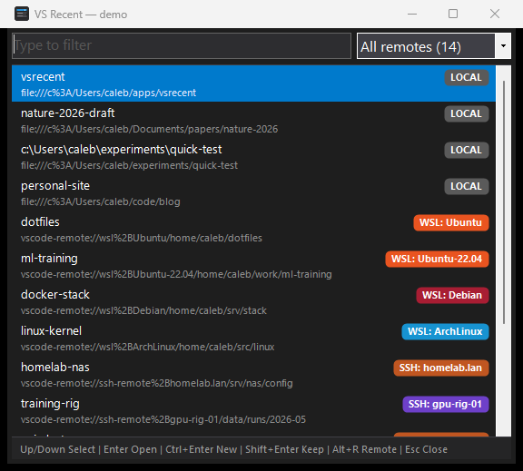

# VS Recent

VS Recent is a Windows launcher for folders in VS Code's **Open Recent**
history. Type to filter, then press Enter or double-click an entry to open it.



- Self-contained .NET 9 WinForms executable for **x64** and **ARM64** Windows.
  The target machine does not need a .NET runtime.
- Reads VS Code's recent-folder list from
  `%USERPROFILE%\.vscode-shared\sharedStorage\state.vscdb` via
  Windows' `winsqlite3.dll`.
- Shows local and remote entries from *File > Open Recent > More...*, including
  WSL, SSH, Dev Containers, Codespaces, and GitHub. Each row has a
  pill showing the remote kind (`LOCAL`, `WSL: Ubuntu`, `SSH: hostname`,
  `DEV CONTAINER`, `CODESPACE`, or `GITHUB`).
- Starts `Code.exe --folder-uri "<uri>"` and exits without terminating the
  VS Code window.

## Download

Download the executable for your architecture from the
[Releases page](../../releases):

- `vsrecent-win-x64.exe`: Intel/AMD 64-bit Windows
- `vsrecent-win-arm64.exe`: Windows on ARM

The executables are unsigned. If Windows SmartScreen blocks the first launch,
select *More info > Run anyway*.

## Install

Install the latest release:

```powershell
& ([scriptblock]::Create((irm https://raw.githubusercontent.com/calebrob6/vsrecent/main/install.ps1)))
```

It detects x64 or ARM64, downloads the latest release to
`%LOCALAPPDATA%\Programs\VS Recent`, and creates a Start Menu shortcut. The
installation does not require administrator rights.

When running `install.ps1` from a checkout, use `-Version 0.2.0` to install a
specific release, `-Hotkey "CTRL+ALT+R"` to assign a shortcut hotkey,
`-NoShortcut` to install only the executable, or `-Launch` to run VS Recent
after installation.

## Files

| File          | Purpose                                                       |
| ------------- | ------------------------------------------------------------- |
| `VsRecent.cs` | Form, filter, launch logic, JSON parsing                      |
| `Sqlite.cs`   | P/Invoke wrapper around Windows' built-in `winsqlite3.dll`    |
| `vsrecent.csproj` | SDK-style project (.NET 9, WinForms, single-file publish) |
| `vsrecent.ico`| App icon (multi-size, embedded in EXE)                        |
| `_make_icon.py` | Regenerates `vsrecent.ico` (requires Python + Pillow)       |
| `build.cmd`   | Publishes for the host architecture                           |
| `install.ps1` | Downloads and installs the latest release for the current user |
| `install_hotkey.ps1` | Creates a Start-Menu shortcut with a global hotkey     |
| `vsrecent_hotkey.ahk`| AutoHotkey v2 global `Win+key` shortcut                  |
| `.github/workflows/release.yml` | CI: builds win-x64 + win-arm64 and publishes a GitHub Release on `v*` tag |

## Build locally

Install the [.NET 9 SDK](https://dotnet.microsoft.com/download), then run:

```
build.cmd
```

The script detects the host architecture and writes the executable to
`publish\<rid>\vsrecent.exe`. The equivalent x64 command is:

```
dotnet publish vsrecent.csproj -c Release -r win-x64 --self-contained=true -o publish\win-x64
```

## Cut a release

Create and push a `v*` tag:

```
git tag v0.1.0
git push --tags
```

`.github/workflows/release.yml` builds both architectures and attaches both
executables to a GitHub Release. The tag supplies the release version;
`<Version>` in `vsrecent.csproj` applies to local builds.

## Run

Run `vsrecent.exe`. The window opens on the active monitor with the filter
focused.

### Keys

| Key                  | Action                                            |
| -------------------- | ------------------------------------------------- |
| Type                 | Filter label, URI, and remote name using case-insensitive AND tokens |
| `Up` / `Down`        | Move highlight up / down without leaving the filter |
| `PgUp` / `PgDn`      | Move highlight by 8 rows                          |
| `Ctrl+Home` / `End`  | Jump to first / last visible entry                |
| `Enter`              | Launch highlighted entry in VS Code, then close   |
| `Ctrl+Enter`         | Launch in a new VS Code window, then close        |
| `Shift+Enter`        | Launch and keep VS Recent open                    |
| `Ctrl+Shift+Enter`   | Launch in a new window and keep VS Recent open    |
| `Alt+R`              | Open the Remote dropdown                          |
| Double-click         | Same as Enter on that row                         |
| `Esc`                | Close without launching                           |

### Filtering by remote

The **Remote** dropdown lists each remote kind with its entry count. Its
selection combines with the text filter. For example, select **WSL** and type
`dotfiles` to show matching WSL entries. Remote names are also searchable, so
queries such as `local foo` and `wsl ml` work without the dropdown.

## Launch shortcuts

### Windows shortcut

Run `install_hotkey.ps1` to create a Start Menu shortcut and assign a global
hotkey:

```
powershell -ExecutionPolicy Bypass -File install_hotkey.ps1 -ExePath "C:\path\to\vsrecent.exe" -Hotkey "CTRL+ALT+R"
```

The shortcut is written to
`%APPDATA%\Microsoft\Windows\Start Menu\Programs\VS Recent.lnk`. Shortcut
hotkeys must start with `Ctrl+Alt`, `Ctrl+Shift`, or `Shift+Alt`. Windows may
delay the first shortcut launch by 200-500 ms.

### AutoHotkey

`vsrecent_hotkey.ahk` requires
[AutoHotkey v2](https://www.autohotkey.com/) and expects `vsrecent.exe` in the
same directory. It binds **`Win+Shift+R`** by default. Edit the script to
change the binding, or add a shortcut to the script in `shell:startup` to run
it at logon.

### Taskbar

Pin `vsrecent.exe` to the taskbar to launch it with the corresponding
`Win+1` through `Win+9` shortcut.

## Notes

- The database is opened read-only so VS Code can use it concurrently. If the
  live database cannot be read, VS Recent copies `state.vscdb`, `-wal`, and
  `-shm` to `%TEMP%` and reads the snapshot.
- Only entries with a `folderUri` are shown. Single-file `fileUri` entries are
  skipped.
- `Code.exe` is resolved in this order:
  1. `%LOCALAPPDATA%\Programs\Microsoft VS Code\Code.exe`
  2. `%PROGRAMFILES%\Microsoft VS Code\Code.exe`
  3. `%PROGRAMFILES(X86)%\Microsoft VS Code\Code.exe`
  4. `code` on `PATH`

## License

[MIT](LICENSE)
