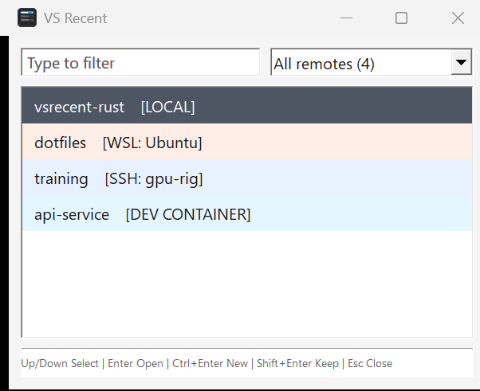
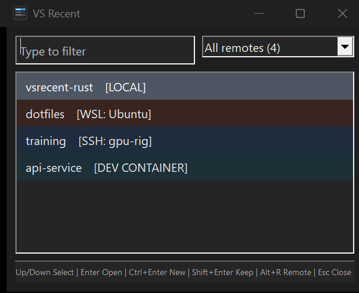

# VS Recent

VS Recent is an instant native Windows picker for folders in VS Code's **Open Recent** history. Pin it to the taskbar and press the matching `Win+1` through `Win+9` shortcut, type a few characters, and press Enter.

[Download VS Recent and read how it starts so quickly](https://calebrob.com/vsrecent/).

A tiny tool in the spirit of Scott Hanselman's
[Tiny Tool Town](https://www.tinytooltown.com/) — made for an audience of one,
shared in case it is useful to anyone else.

| Light | Dark |
| --- | --- |
|  |  |

## Features

- Reads `%USERPROFILE%\.vscode-shared\sharedStorage\state.vscdb` through Windows' built-in `winsqlite3.dll`.
- Preserves local and remote folder URIs for WSL, SSH, Dev Containers, Codespaces, tunnels, and GitHub.
- Follows the Windows app theme setting for native light or dark mode.
- Colors each row by its local or remote kind for faster visual scanning.
- Filters labels, original URIs, and remote names using case-insensitive AND semantics.
- Uses only Windows system DLLs at runtime; Rust dependencies are statically linked.
- Produces a small, self-contained `vsrecent.exe` for x64 and ARM64.

## Build

Install Rust and the Visual Studio C++ build tools on Windows:

```powershell
winget install --id Rustlang.Rustup --exact
winget install --id Microsoft.VisualStudio.2022.BuildTools --exact --override "--wait --passive --add Microsoft.VisualStudio.Workload.VCTools --includeRecommended"
```

Build the optimized executable:

```powershell
build.cmd
```

The result is `publish\vsrecent.exe`. For a UI smoke test that does not depend on local VS Code history:

```powershell
cargo run --release -- --demo
```

Use `--demo --light` or `--demo --dark` to force a theme when updating screenshots. Normal launches follow the user's Windows app theme.

CI builds both supported architectures on native GitHub-hosted runners:

| Artifact | Rust target | Runner |
| --- | --- | --- |
| `vsrecent-win-x64.exe` | `x86_64-pc-windows-msvc` | `windows-latest` |
| `vsrecent-win-arm64.exe` | `aarch64-pc-windows-msvc` | `windows-11-arm` |

The matrix runs for every pull request and manual workflow dispatch. Pushing a `v*` tag builds both executables and attaches them to a GitHub Release.

Compare startup-to-first-window performance between two optimized builds on the same machine:

```powershell
.\scripts\benchmark-startup.ps1 `
    -BaselineExecutable .\artifacts\main\vsrecent.exe `
    -CandidateExecutable .\publish\vsrecent.exe
```

The benchmark checks that both executables have the same architecture, performs warmups, and reports median and p95 startup times. Close any running VS Recent window before starting it.

## Keys

| Key | Action |
| --- | --- |
| Type | Filter recent folders |
| `Ctrl+A` | Select all filter text |
| `Up` / `Down` | Move the selection |
| `PgUp` / `PgDn` | Move by eight rows |
| `Ctrl+Home` / `Ctrl+End` | Select the first or last result |
| `Enter` | Open the selected folder and close |
| `Ctrl+Enter` | Open in a new VS Code window and close |
| `Shift+Enter` | Open and keep the picker visible |
| `Esc` | Close |

## Fast taskbar launch

Copy `vsrecent.exe` to a stable location, launch it once, right-click its taskbar icon, and select **Pin to taskbar**. Move it to the first taskbar position to launch it with `Win+1`.

The included `install.ps1` installs release artifacts and creates a Start Menu shortcut. `vsrecent_hotkey.ahk` remains available for a dedicated global shortcut.

## Implementation

Startup deliberately performs only native window-class registration and control creation on the UI thread. Once the first paint is requested, a worker thread opens the VS Code database read-only, parses its recent-folder JSON, builds the search index, and posts the completed list to the UI thread. If the live WAL database cannot be read, it snapshots the database and its `-wal` and `-shm` files into a process-specific temporary directory and retries.

See [How VS Recent starts quickly](https://calebrob.com/vsrecent/#startup) for a detailed comparison with the former C# WinForms implementation.

## License

[MIT](LICENSE)
